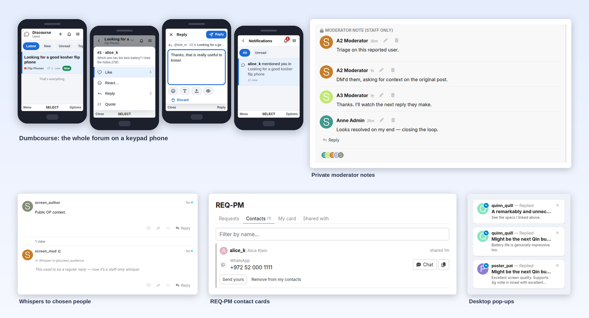

<p align="center">
</p>

<h1 align="center">Jtech Tools</h1>

<p align="center"><b>Dumb Nautas edition</b> — Criptonautas' build of Jtech Tools. See <a href="EDITION.md">EDITION.md</a> for what it changes and how it syncs.</p>

<p align="center">
  The plugin behind <a href="https://forums.jtechforums.org">JTech Forums</a>: everything we run on top of Discourse, in one place.
</p>

<p align="center">
  
</p>

---

We built these tools for our own forum as the need came up. Some help moderators work, some keep private things private, and one makes the forum usable on a flip phone. They live in one plugin so there's one thing to install and update. Every piece has its own switch, so you only run what you want.

## What's inside

**For moderators**

- **[Moderator tools](docs/features/moderator-tools.md).** Whispers to specific people inside a topic, private staff notes, alerts when another moderator acts, checklists before posting, and small topic tools like footer messages and reply approval.
- **[Mini-mod](docs/features/mini-mod.md).** A few extra rights for people who moderate a single category: managing their categories, moving topics, tags. None of it reaches past what they can see.
- **[Dislike](docs/features/dislike.md).** In the categories you choose, likes stop counting: no notifications, no history, no leaderboard.

**For members**

- **[REQ-PM](docs/features/reqpm.md).** The forum has no private messages. Members ask each other for contact details, and choose exactly what to share.
- **[Dumbcourse](docs/features/dumbcourse.md).** The whole forum at `/dumb`, built for flip phones and old browsers, driven by the D-pad and keypad.
- **[Smart search](docs/features/smart-search.md).** When a search finds too little, it tries again with synonyms, so "k8s" finds "kubernetes".
- **[Desktop pop-ups](docs/features/popups.md).** A small card in the corner when a notification arrives.

**Behind the scenes**

- **[Disteleplus](docs/features/disteleplus.md).** A chat room for staff, mirrored both ways with a Telegram group, with the review queue in Telegram too.
- **[Another SMTP](docs/features/another-smtp.md).** Send forum email through a different mail server.
- **[Translator tweaks](docs/features/translator-tweaks.md).** A proxy for the Translator plugin's Google requests.

## Installing

Add the plugin to your `app.yml` and rebuild:

```yaml
hooks:
  after_code:
    - exec:
        cd: $home/plugins
        cmd:
          - git clone https://github.com/JTech-Forums/JtechTools.git jtech-tools
```

```bash
cd /var/discourse
./launcher rebuild app
```

Keep the folder name `jtech-tools` (lowercase). Discourse builds the plugin's stylesheet address from it.

## Turning things on

Everything is under **Admin → Plugins → Jtech Tools**, one tab per feature. Some features start switched off; each feature's page says what to set first.

`jtech_enabled` is the master switch. Turning it off stops everything at once, including the permission changes and background jobs. Private things stay private either way: switching whispers off never makes an existing whisper public.

Upgrading? [CHANGELOG.md](CHANGELOG.md) lists what changed and anything worth checking afterwards.

## Working on it

Start with the [repository rules](AGENTS.md) and [CONTRIBUTING.md](CONTRIBUTING.md). The developer docs cover [how it's put together](docs/development/architecture.md) and [how to run it and its tests](docs/development/testing.md). Everything else is in [docs/](docs/README.md).

Found a security problem? Please report it privately; see [SECURITY.md](SECURITY.md).

## License

[GPL-3.0](LICENSE). Made by TripleU, Shalom Karr and Ars18 for JTech Forums.
