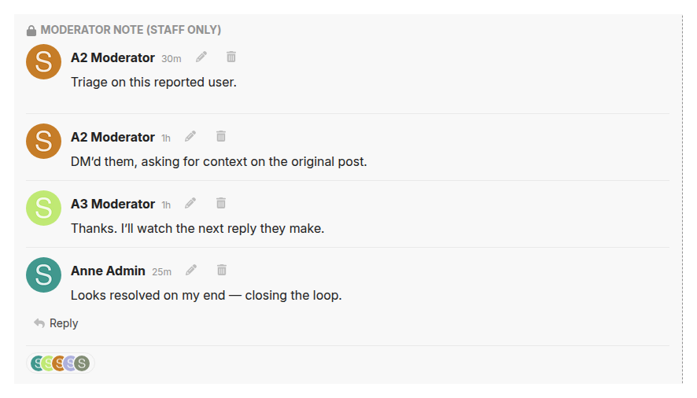
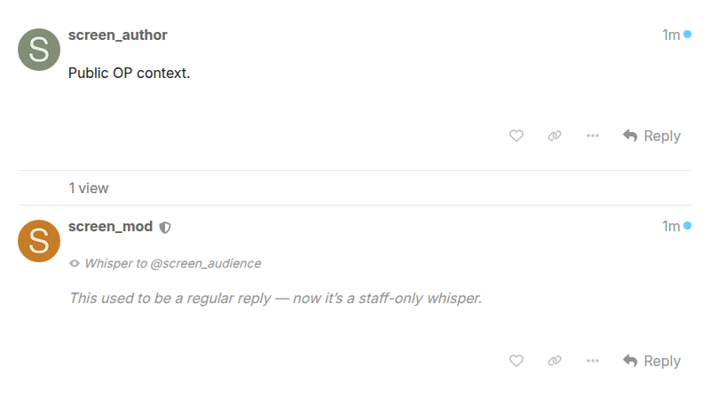

# Moderator tools

Tools that help moderators run conversations without leaving the topic. Each one has its own switch, and the whole module turns off with `mod_categories_enabled`.

Everything here works only on topics the moderator can see, and alerts only go to staff who can open what they point at. Moderators don't see every private message or every restricted category, and the tools respect that.

## Whispers

Reply inside a topic to specific people: users, groups or everyone holding a badge. A whisper is visible only to staff, its author and the people it names. It doesn't show up anywhere else: not in the topic, search, activity streams, emails, notifications, link previews, RSS, Dumbcourse or the Telegram bridge.

- Replies to a whisper, and quotes of one, stay private to the same people automatically.
- A whisper never bumps its topic or counts as new for people outside its audience. For the people it's addressed to it counts as unread, and they get one notification.
- Staff can turn an existing post into a whisper, or make a whisper public. Each change is logged under Staff actions. Only admins can do this to another staff member's post.
- Turning whispers off stops new ones. Existing whispers stay private whatever the switches say.

## Private notes

A staff-only note on a topic, with a reply thread and a "seen by" list. New notes and replies show up in the bell and in a shield tab in the user menu, but only for staff who can see the topic.

## Staff alerts

Staff are told when another staff member:

- deletes a post;
- approves or rejects a queued post;
- adds a note to a user or to a flag.

Each kind has its own switch. An alert goes only to staff who can see the topic or review item it's about.

## Checklists

- **First-post checklist**: a list new members tick before their first post.
- **Targeted checklists**: aimed at named users, whatever their trust level.
- **Topic checklists**: attached to one topic, shown before replying.
- **Category checklists**: set in a category's settings; each person accepts once before starting a topic or replying there. Enforced on the server too.

Acceptances are logged, once per version.

## Topic tools

- **Footer message**: a short note shown under a topic.
- **Pinned post**: copies a chosen post to the bottom of the topic.
- **Reply approval**: sends every reply in one topic to the review queue.
- **New-topic prompt**: a "before you post" note per category.
- **Badge picker**: adds everyone holding a badge to a private message.

## Categories

Letting moderators create and edit categories is core's `moderators_manage_categories` setting. This module used to grant it itself, without core's check that the moderator can see the category. On upgrade, sites that had the old grant on get the core setting switched on.

## Settings

Admin → Plugins → Jtech Tools → **Mod**. The full text of each setting is shown next to it in the admin.

| Setting | Default | What it does |
| --- | --- | --- |
| `mod_categories_enabled` | `true` | Master switch for the moderator tools in this module — topic tools, checklists, private staff notes and staff event notifications. |
| `precheck_new_topic_enabled` | `true` | Shows a "before you post" prompt when a user starts a topic in a category that has one set. |
| `topic_footer_message_enabled` | `true` | Lets moderators pin a message below the last reply of a topic. |
| `mod_pin_post_enabled` | `true` | Lets moderators pin any post in a topic to the bottom of that topic. |
| `mod_topic_require_reply_approval_enabled` | `true` | Lets moderators flag individual topics so every reply goes to the review queue first. |
| `mod_pm_badge_group_enabled` | `true` | Lets staff composing a personal message expand a badge into its current holders as recipients. |
| `mod_first_post_checklist_enabled` | `true` | Lets moderators maintain a checklist that users must accept before they can post, up to a trust-level cap set in the checklist itself (TL2 by default). |
| `mod_targeted_checklists_enabled` | `true` | Lets moderators aim a checklist at named users, blocking their posting anywhere on the forum until they accept — regardless of trust level, and including other moderators. |
| `mod_topic_prompt_checklist_enabled` | `true` | Lets moderators attach a blocking checklist or single statement to one topic, shown before posting in it. |
| `topic_reply_prompt_enabled` | `true` | Legacy — replaced by per-topic prompt checklists. |
| `mod_topic_private_notes_enabled` | `true` | Lets staff attach a private note, with a reply thread, to any topic. |
| `mod_moderators_can_edit_others_notes` | `false` | When on, any moderator may edit or delete notes and note replies written by other staff. |
| `mod_note_view_tracking_enabled` | `true` | Records each staff member's name and the time they opened a topic's note panel, and shows the list ("Viewed by N") to all staff on that topic. |
| `mod_notes_feed_enabled` | `true` | The staff user-menu shield tab — a cross-forum feed of noted topics and staff events, with its unread counter kept in sync with the notification bell. |
| `mod_notify_staff_on_topic_notes` | `true` | Sends every other admin and moderator a bell notification and live alert when a staff member writes or replies to a topic note. |
| `mod_notify_staff_on_post_actions` | `true` | Notifies every other staff member when a moderator deletes a post or rejects a queued post. |
| `mod_notify_staff_on_post_approved` | `false` | Notifies every other staff member when a moderator approves a queued post. |
| `mod_notify_staff_on_user_notes` | `true` | Notifies every other staff member when a moderator adds a note to a user's profile. |
| `mod_notify_staff_on_flag_notes` | `true` | Notifies every other staff member when a moderator adds a note to a flag or other reviewable in the review queue. |
| `mod_notify_whisper_targets` | `true` | Sends a bell notification to a whisper's audience when one is posted, and to a user when staff add them to a whisper. |
| `mod_auto_mark_notifications_seen` | `true` | Opening a topic, or the review queue, marks THIS plugin's own note and whisper notifications for it as read. |
| `mod_notification_type_filter_enabled` | `true` | Adds a type filter to the user notifications page, plus a staff-only mod-notes stream. |
| `mod_whisper_enabled` | `true` | Master switch for creating whispers — independent of Enable Mod, so whispers keep working when the rest of the module is off. |
| `mod_whisper_add_participant_enabled` | `true` | Lets staff add users to an existing whisper. |
| `mod_whisper_convert_enabled` | `true` | Lets staff turn an existing post into a whisper and back, and retarget its audience. |
| `mod_whisper_badge_targeting_enabled` | `true` | Lets staff target whispers at badge holders as well as users and groups. |
| `mod_whisper_audience_aware_topic_list` | `true` | Lets a whisper count as a new, unread post for the non-staff users, groups and badge holders it is addressed to (staff always see whispers as new). |

[← All features](../README.md#features)
