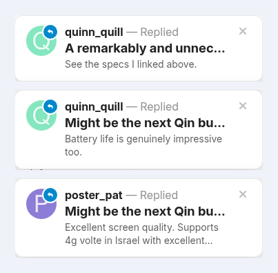

# Desktop pop-ups

A small card in the top-right corner when you get a notification. It shows the person's avatar, the topic title and a preview. Click it to jump there, or close it. It stays put while you hover over it or tab to it.

- Each member turns it on under Preferences → Account.
- Desktop only, and quiet during Do Not Disturb.
- You can leave out some kinds of notification, such as likes, for everyone (`popup_notifications_excluded_types`).
- Works with the keyboard and screen readers, and respects reduced motion.

## Settings

Admin → Plugins → Jtech Tools → **Pop-ups**. The full text of each setting is shown next to it in the admin.

| Setting | Default | What it does |
| --- | --- | --- |
| `popup_notifications_enabled` | `true` | Show a small pop-up card in the top-right corner when a notification arrives. |
| `popup_notifications_default_enabled` | `false` | What "Desktop Pop Up Notifications" starts out as for users who have never touched it on their account page. |
| `popup_notifications_timeout_seconds` | `20` | How long a card stays on screen before it disappears on its own. |
| `popup_notifications_max_stack` | `3` | How many cards may be stacked at once. |
| `popup_notifications_excluded_types` | `(blank)` | Notification kinds to leave out of the pop-ups — likes, for example, are usually the noisiest. |

[← All features](../README.md#features)
