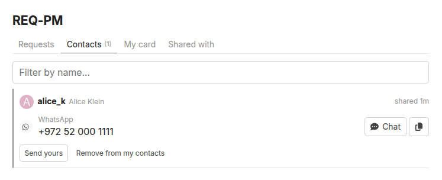

# REQ-PM: contact details instead of private messages

The forum has no private messages. REQ-PM is how members reach each other off the forum, without anyone (members or staff) being able to read a conversation.

- **Your card.** Add Phone, Text message, WhatsApp, Email, Website, Telegram, Signal, Discord, or **Something else** with your own name and emoji. Each field has the right keyboard and checks, and an optional short note ("evenings only").
- **Request.** Press **REQ-PM** on someone's user card or profile, then *Request their contact details*. You can tick what you'd like. There's no text box, so it can't become a back door for messages.
- **Send.** They get a notification, tick exactly which details you may see, and send. You can also send your own details without being asked. Either side can take back what they sent, or remove a card they received, at any time, silently.
- **Declining is silent.** The requester only ever sees "waiting", then "expired".
- **One page for all of it.** `/reqpm` has *Requests*, *Contacts* (with Call / Text / Chat / Email buttons), *My card* and *Shared with*. It's in the avatar menu and the sidebar's *More* list. Your card is also under Preferences → REQ-PM.
- **Setup prompt.** Members with an empty card are asked to add a way to reach them. The prompt is *gentle* (can be snoozed or declined), *required* (comes back on every page) or *off* (`reqpm_setup_prompt`).

## Privacy

- Values are encrypted at rest (AES-256-GCM), each bound to its owner and field.
- They're only returned to their owner and the people the owner chose.
- There's no admin screen for them.
- The endpoints refuse API keys and admin impersonation.
- Ignores and mutes apply to staff too.
- Values are masked in request logs.
- Notifications carry who and what, never a value.

The key comes from the server's `secret_key_base`, which isn't in a Discourse backup. After restoring onto a *different* server, cards show "please re-enter" instead of the old values.

## Limits

All adjustable:

- 10 requests and 20 sends per day;
- 3 days before asking the same person again;
- requests expire after 30 days;
- 10 methods per card.

Staged, suspended, silenced and anonymous accounts can't take part. Phone numbers without a country code get `reqpm_default_country_code` (+1 by default).

## Settings

Admin → Plugins → Jtech Tools → **REQ-PM**. The full text of each setting is shown next to it in the admin.

| Setting | Default | What it does |
| --- | --- | --- |
| `reqpm_enabled` | `true` | REQ-PM lets members exchange contact details (phone, text, WhatsApp, email, website, or their own custom ones) instead of private messages. |
| `reqpm_allowed_groups` | `10` | Groups that can use REQ-PM (send, request and receive). |
| `reqpm_setup_prompt` | `gentle` | How strongly members without any contact details are asked to add some — new signups and existing members alike. |
| `reqpm_setup_snooze_days` | `7` | How long "Remind me later" hides the setup window for. |
| `reqpm_default_country_code` | `1` | Country calling code assumed for phone, text, WhatsApp, Signal and Telegram numbers typed without one — 1 for US/Canada. |
| `reqpm_max_methods` | `10` | Most contact methods one member can keep on their card. |
| `reqpm_max_requests_per_day` | `10` | Most contact requests one member can send in 24 hours. |
| `reqpm_max_shares_per_day` | `20` | Most times one member can send their details (to anyone) in 24 hours. |
| `reqpm_request_cooldown_days` | `3` | After asking someone, how many days before the same member can ask that person again — whatever the answer was. |
| `reqpm_request_expiry_days` | `30` | Unanswered requests close after this many days. |

[← All features](../README.md#features)
